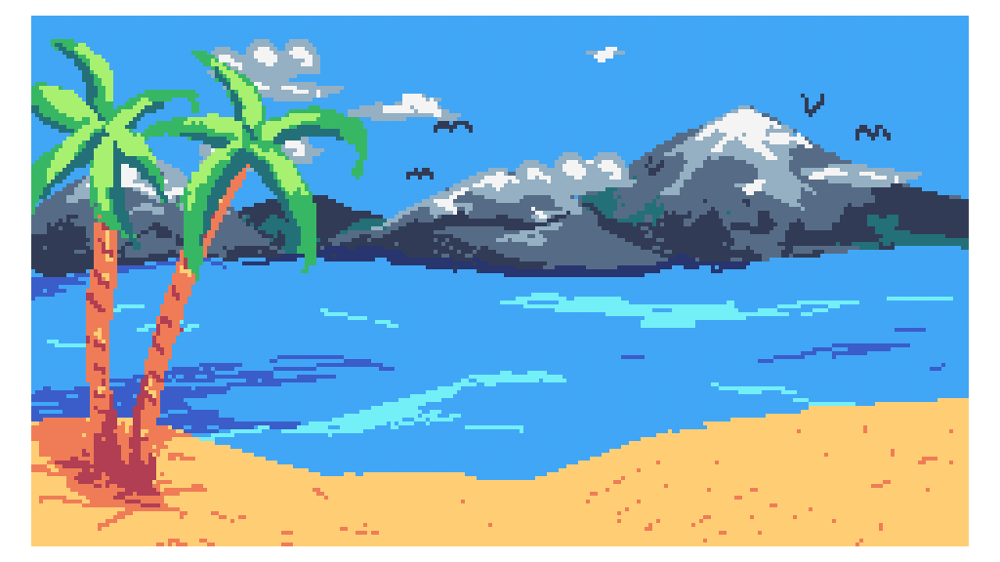

# Beach Relaxation #

This demo was made for the Evoke 2025 Alternative Platform
competition, it achieved the 4th place. Watch the demo, enjoy and
relax!

| Credits  |                                                                 |
|----------|-----------------------------------------------------------------|
| Code     | Pararaum                                                        |
| Font     | m4d                                                             |
| Font     | [DamienG](https://damieng.com/typography/zx-origins/beachball/) |
| Graphics | Nerouine                                                        |
| Graphics | Logiker                                                         |
| Music    | mAZE                                                            |



## Building ##

The demo code was separated into multiple files and therefore needs to
be build. The tools needed for building have been encapsulated into a
[Docker Image](https://hub.docker.com/r/vintagecomputingcarinthia/tic80build
"https://hub.docker.com/r/vintagecomputingcarinthia/tic80build"). Use
the command line to build the demo:

```
docker run -u 1000:10 --rm -it -v $PWD:/host -w /host vintagecomputingcarinthia/tic80build:Evoke2025 ./Makefile
```

After the make process is finished a file called
"beach_relaxation.cooked.lua" is generated. This file can be loaded
into Tic-80 (you will need the payed version, though, as this is the
version which can load Lua code directly).

## Links ##

  * <https://demozoo.org/productions/376676/>
  * <https://www.pouet.net/prod.php?which=104896>
  * [Source](https://github.com/pararaum/tic80playground/tree/main/Evoke.2025 "https://github.com/pararaum/tic80playground/tree/main/Evoke.2025")
  * [Competition Version](https://files.scene.org/get/parties/2025/evoke25/alternative_platforms/the_7th_division-beach_relaxation.zip)
